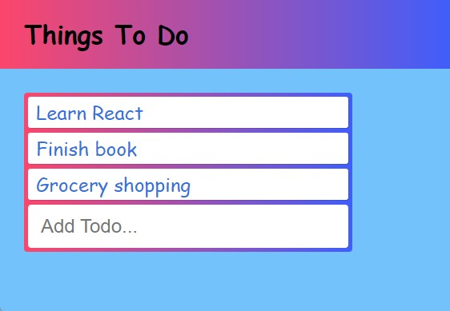

# A Simple ToDo List

This is a basic CRUD app that lets you create your own ToDo list. Enter your tasks and as you complete them, simply click the task to have it completed and removed from the list. This was created using React, JavaScript, CSS, and HTML.

## Installation

Fork this repository and clone it or download all files by clicking the green code button. Make sure to save them to the same directory on your computer. Load the index.html file into your browser. Start adding your tasks and click once they are complete.

You can also interact with the page without having to download the files.

<a href="https://leahselig.github.io/Simple-ToDo-List/"> Try It Out Here! </a>

## Roadmap

- [ ] Add checkboxes for task accomplishment

## License
Copyright (c) 2022 MIT  Leah Selig

Permission is hereby granted, free of charge, to any person obtaining a copy of this software and associated documentation files (the "Software"), to deal in the Software without restriction, including without limitation the rights to use, copy, modify, merge, publish, distribute, sublicense, and/or sell copies of the Software, and to permit persons to whom the Software is furnished to do so, subject to the following conditions:

The above copyright notice and this permission notice shall be included in all copies or substantial portions of the Software.

THE SOFTWARE IS PROVIDED "AS IS", WITHOUT WARRANTY OF ANY KIND, EXPRESS OR IMPLIED, INCLUDING BUT NOT LIMITED TO THE WARRANTIES OF MERCHANTABILITY, FITNESS FOR A PARTICULAR PURPOSE AND NONINFRINGEMENT. IN NO EVENT SHALL THE AUTHORS OR COPYRIGHT HOLDERS BE LIABLE FOR ANY CLAIM, DAMAGES OR OTHER LIABILITY, WHETHER IN AN ACTION OF CONTRACT, TORT OR OTHERWISE, ARISING FROM, OUT OF OR IN CONNECTION WITH THE SOFTWARE OR THE USE OR OTHER DEALINGS IN THE SOFTWARE.
